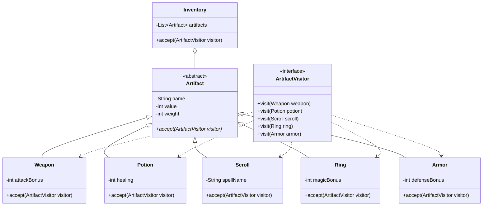
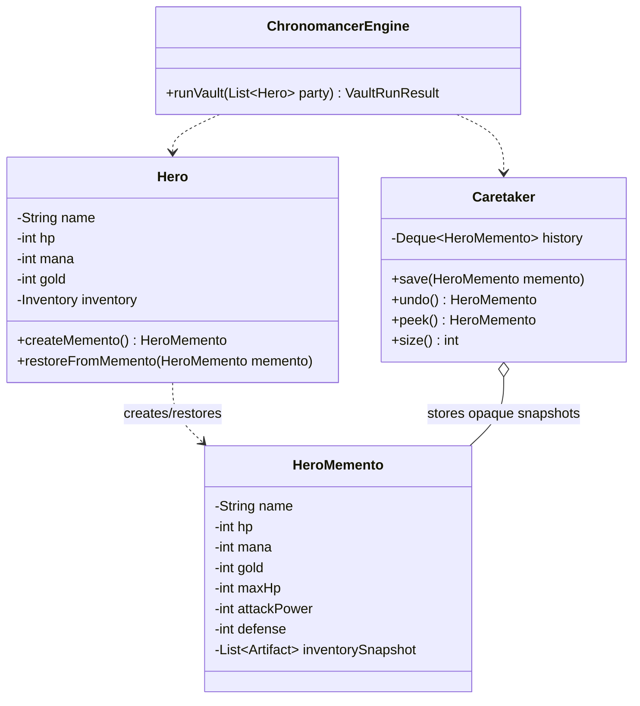

# Student Checklist - Homework 9

Use this checklist to track your progress. Work through the phases in order - each phase builds on the previous one.

---

## Phase 1: Understand the Patterns

- [x] Read `ASSIGNMENT.md` from start to finish
- [x] In your own words, write down what Visitor does and what Memento does
- [x] Identify why the two patterns are independent in this assignment
- [x] Read `FAQ.md` sections on Visitor and Memento
- [x] Review the provided source files in `artifact/`, `combatant/`, `memento/`, and `vault/`

### Phase 1 Notes

Visitor lets the program add new operations for a fixed set of artifact types.
The inventory only walks through artifacts, and each artifact calls the correct
`visit(...)` overload through `accept(visitor)`. This avoids `instanceof` checks
and keeps new appraisal behavior inside new visitor classes.

Memento lets `Hero` save and restore its mutable state without exposing that
state to the caretaker. `Hero` creates and reads `HeroMemento`, while
`Caretaker` only stores snapshots and returns them later.

The patterns are independent because Visitor works with the artifact hierarchy,
while Memento works with hero state. `ChronomancerEngine` can use both during
one demo run, but visitors do not need mementos and mementos do not need
visitors.

---

## Phase 2: Design on Paper First

- [x] Sketch a class diagram showing `ArtifactVisitor` and the artifact hierarchy
- [x] Sketch a class diagram showing `Hero`, `HeroMemento`, and `Caretaker`
- [x] Decide what each of your first 3 visitors will compute or print
- [x] Decide what hero state will be saved in the memento
- [x] Decide what event will trigger the rewind in the demo
- [x] Decide what your 4th visitor will prove for open/closed behavior

### Phase 2 Notes

Visitor sketch:

Memento sketch:

First 3 visitor decisions:

- `GoldAppraiser` estimates resale value and keeps a running total.
- `EnchantmentScanner` prints magical properties based on each artifact type.
- `CurseDetector` reports whether each artifact looks dangerous or safe.

Memento state decision:

- Save `hp`, `mana`, `gold`, and a snapshot of the hero inventory.
- Keep immutable identity/combat fields in the memento too because the scaffold
  already includes `name`, `maxHp`, `attackPower`, and `defense`.
- `Hero` will be the only class that reads these values during restore.

Rewind event decision:

- The demo will save the lead hero before a time crystal trap.
- The trap will damage the hero, spend mana, spend gold, and add a strange
  vault artifact to the inventory.
- The rewind will restore the saved state from the latest `HeroMemento`.

Open/closed visitor decision:

- Add `WeightCalculator` as the 4th visitor.
- It will work through `Inventory.accept(visitor)` and prove that a new report
  can be added without changing the artifact hierarchy.

---

## Phase 3: Implement the Visitor Skeleton

- [x] Create at least 3 concrete visitor classes in separate `.java` files
- [x] Verify each visitor implements all 5 `visit(...)` overloads
- [x] Verify each visitor produces visibly different output
- [x] Implement `accept(ArtifactVisitor visitor)` in `Weapon.java`
- [x] Implement `accept(ArtifactVisitor visitor)` in `Potion.java`
- [x] Implement `accept(ArtifactVisitor visitor)` in `Scroll.java`
- [x] Implement `accept(ArtifactVisitor visitor)` in `Ring.java`
- [x] Implement `accept(ArtifactVisitor visitor)` in `Armor.java`
- [x] Implement `Inventory.accept(visitor)` to walk the list

### Phase 3 Notes

- Added `GoldAppraiser`, `EnchantmentScanner`, and `CurseDetector` in
  `com.narxoz.rpg.visitor`.
- Each visitor implements all five `visit(...)` overloads.
- Each visitor prints distinct output and treats artifact types differently.
- Each artifact now forwards double dispatch through `visitor.visit(this)`.
- `Inventory.accept(visitor)` was already implemented and walks the artifact
  list in order.

---

## Phase 4: Implement the Memento Boundary

- [x] Verify `HeroMemento.java` keeps its getters package-private
- [x] Verify `HeroMemento` has no public mutable fields
- [x] Add the hero fields that belong in the snapshot
- [x] Implement `Hero.createMemento()`
- [x] Implement `Hero.restoreFromMemento(HeroMemento)`
- [x] Keep `Caretaker` in a different package from `HeroMemento`

### Phase 4 Notes

- `HeroMemento` stores snapshot data in private final fields.
- Its constructor and getters are package-private, so `Hero` can use them but
  `Caretaker` cannot inspect the saved state from another package.
- The snapshot includes `hp`, `mana`, `gold`, inventory contents, and the
  scaffold's identity/combat context fields.
- `Hero.createMemento()` captures the current hero state.
- `Hero.restoreFromMemento(HeroMemento)` restores mutable hero state from that
  snapshot and rebuilds the inventory from the saved artifact list.

---

## Phase 5: Implement the Caretaker

- [x] Implement `Caretaker.save(HeroMemento memento)`
- [x] Implement `Caretaker.undo()`
- [x] Implement `Caretaker.peek()`
- [x] Implement `Caretaker.size()`
- [x] Verify `Caretaker` treats mementos as opaque values
- [x] Verify `Caretaker` never reads memento internals

### Phase 5 Notes

- `Caretaker` stores snapshots in a `Deque<HeroMemento>`.
- `save(...)` pushes non-null snapshots onto the history stack.
- `undo()` removes and returns the newest snapshot.
- `peek()` returns the newest snapshot without removing it.
- `size()` reports the number of stored snapshots.
- `Caretaker` never calls getters on `HeroMemento`; it only stores and returns
  opaque snapshot objects.

---

## Phase 6: Implement the Vault Engine

- [x] Fill in `ChronomancerEngine.runVault(...)`
- [x] Build a mixed `Inventory` with at least 5 artifacts
- [x] Apply at least 3 visitors through `Inventory.accept(visitor)`
- [x] Save a hero snapshot before the vault event
- [x] Trigger a state change or trap
- [x] Restore the hero from a saved memento
- [x] Return a meaningful `VaultRunResult`

### Phase 6 Notes

- `ChronomancerEngine.runVault(...)` now builds a five-item mixed inventory:
  weapon, potion, scroll, ring, and armor.
- The engine applies `GoldAppraiser`, `EnchantmentScanner`, and
  `CurseDetector` through `Inventory.accept(visitor)`.
- The lead hero is saved through `Hero.createMemento()` before the time crystal
  trap changes HP, mana, gold, and inventory.
- The rewind uses `Caretaker.undo()` and `Hero.restoreFromMemento(...)`.
- The returned `VaultRunResult` reports appraised artifacts, created
  mementos, and completed restores.

---

## Phase 7: Wire Everything in Main.java

- [ ] Create at least 2 heroes with different starting states
- [ ] Instantiate your concrete visitors
- [ ] Instantiate `ChronomancerEngine`
- [ ] Run the vault demo
- [ ] Print the final `VaultRunResult`
- [ ] Make sure the banner prints without crashing

---

## Phase 8: Verify Output and Open/Closed Behavior

- [ ] The output clearly shows when appraisal starts and ends
- [ ] The output clearly shows when the snapshot is taken
- [ ] The output clearly shows when the rewind happens
- [ ] At least one visitor behaves differently for at least 2 artifact types
- [ ] Add a 4th visitor without modifying any file under `artifact/`
- [ ] Confirm the new visitor works through `Inventory.accept(visitor)`

---

## Phase 9: Draw UML Diagrams and Submit

- [ ] **Diagram 1 - Visitor:** interface, all artifact classes, and `Inventory`
- [ ] **Diagram 2 - Memento:** `Hero`, `HeroMemento`, `Caretaker`, and `ChronomancerEngine`
- [ ] Check that both diagrams are legible and clearly labeled
- [ ] Confirm all `.java` files compile
- [ ] Confirm no `.class` files are included in the ZIP
- [ ] Submit the finished homework
